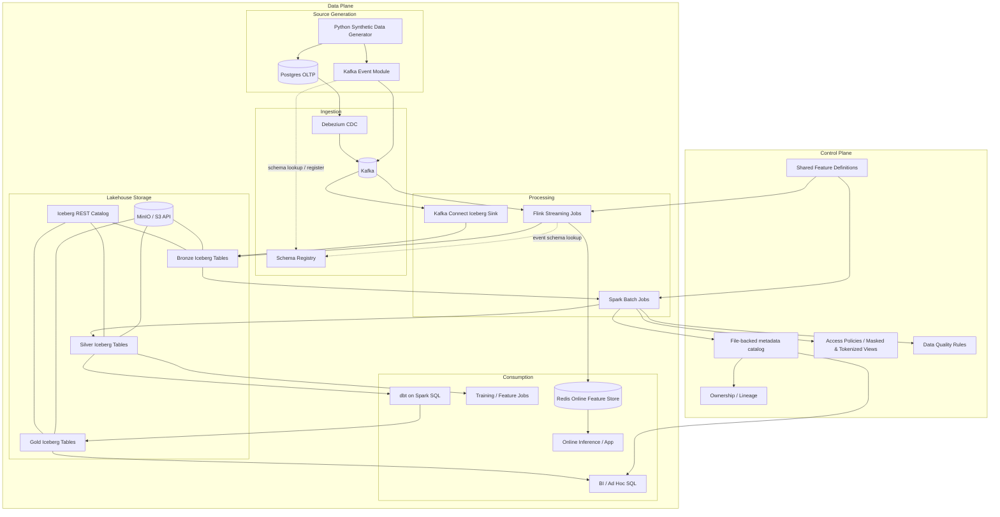
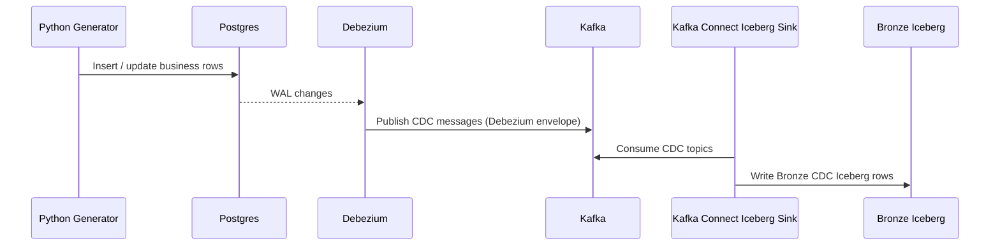
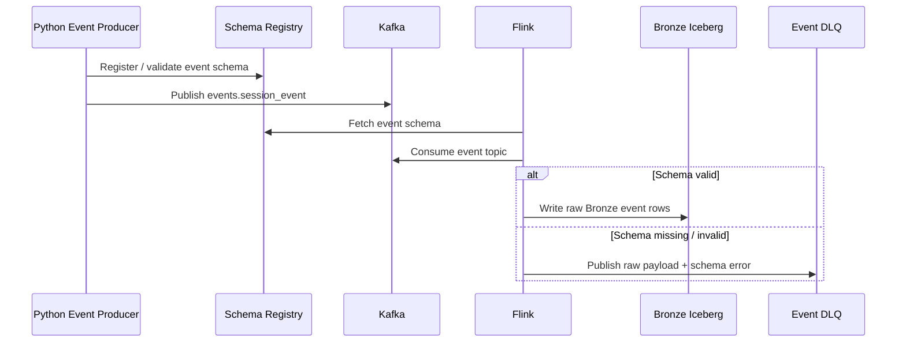
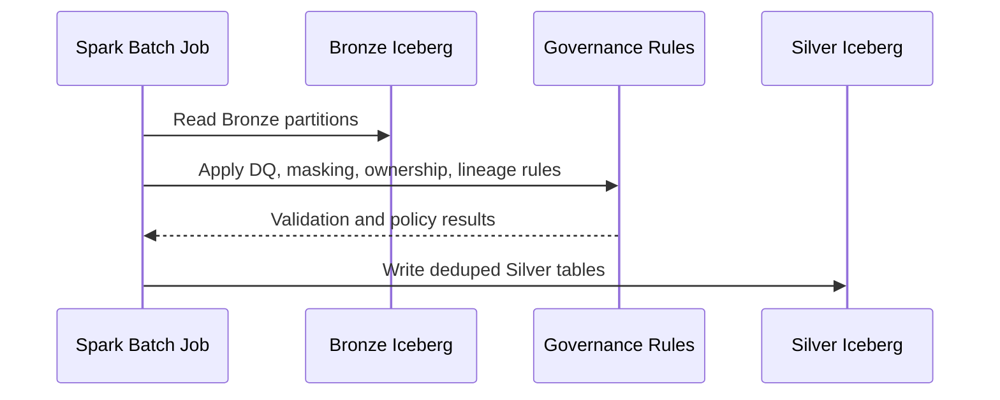
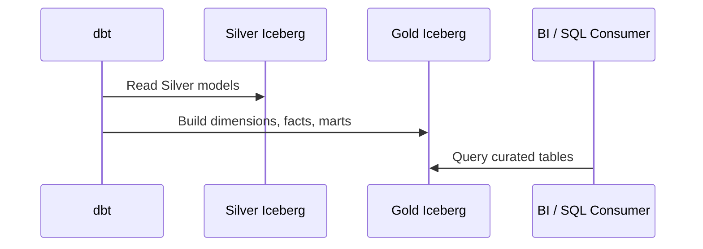
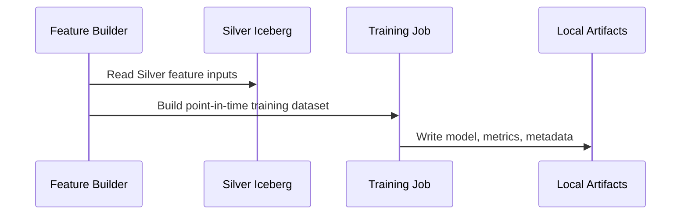
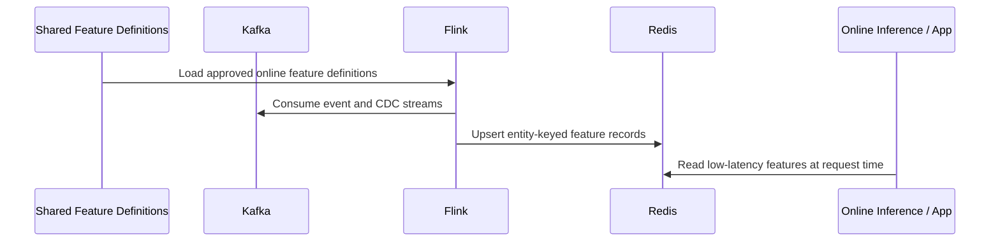

# Unified Laptop-Scale Data + ML Platform Architecture



## 1. Purpose

`ARCHITECTURE.md` is the build-oriented specification for the repository.

Human-oriented rationale, tool-choice explanation, and business framing have been moved to [architecture_rationale.md](./docs/architecture_rationale.md).

## 2. Goals

Implementation goals and rationale are documented in [architecture_rationale.md](./docs/architecture_rationale.md). The remaining sections in this document should be treated as the actionable repo-building contract.

## 3. Functional Requirements

### Source and ingestion
- Generate synthetic business entities and transactions into Postgres.
- Generate synthetic behavioral events directly into Kafka.
- Capture CDC from Postgres tables using Debezium.
- Publish CDC topics and direct event topics into Kafka.
- Land CDC Bronze tables from Kafka topics into Iceberg using one Kafka Connect Iceberg sink connector per Postgres source table.
- Preserve event-time and ingest-time metadata.

### Streaming and storage
- Consume direct event topics using Flink.
- Land raw append history into Bronze Iceberg tables.
- Preserve CDC operation semantics in Bronze.
- Support partitioned Iceberg tables on MinIO.
- Update approved low-latency online features in Redis from streaming inputs.

### Batch and Silver processing
- Read Bronze data using Spark.
- Validate schema, null, uniqueness, volume, drift, and reconciliation quality rules.
- Deduplicate records deterministically.
- Apply masking rules for sensitive columns.
- Apply tokenization rules for restricted joinable identifiers where masking is insufficient.
- Apply RBAC/ABAC-aligned views or table variants.
- Produce Silver current-state tables and Silver clean fact tables.
- Support historical backfills from Bronze.

### Curated analytics
- Use dbt to run Spark SQL transformations.
- Build Gold dimensions, facts, aggregate marts, and ML feature tables from Silver.
- Expose BI-ready tables for dashboarding and ad hoc SQL.
- Serve at least one open-source dashboard application against Gold through a SQL query engine.

### ML / MLOps
- Train models from dbt-built feature tables in `iceberg.silver`.
- Build reusable feature datasets from Silver through dbt.
- Maintain shared versioned feature definitions for offline and online feature computation.
- Publish selected low-latency features to Redis from streaming inputs.
- Support batch retraining.
- Cache model artifacts locally, publish canonical copies to MinIO, and register model metadata in `iceberg.silver.ml_model_registry`.

### Governance and metadata
- Register table ownership.
- Track lineage across Bronze, Silver, and Gold.
- Document data quality checks.
- Mark classification tags, masked/tokenized columns, and access expectations.
- Declare certification tier and discoverability metadata for published datasets.

## 4. Non-Functional Requirements

### Performance
- Must run on a developer desktop using Docker Compose.
- Default dataset sizes must fit within modest laptop memory.
- Streaming jobs should tolerate low-to-moderate event rates without cluster tuning.

### Reliability
- Bronze must be replayable from Kafka and rebuildable from source streams.
- Silver must be rebuildable from Bronze.
- Gold must be rebuildable from Silver.
- Online feature state must be rebuildable from retained Silver feature snapshots or replayable event streams.

### Maintainability
- All schemas must be defined explicitly.
- Transformation contracts must be documented.
- Feature definitions must be versioned once and reused across offline and online execution paths.
- Services must be startable independently.

### Scalability
- The logical design must scale beyond laptop mode, even if the local implementation is intentionally small.
- Partitioning and table design should match real production patterns where practical.

### Security / Governance
- PII must never appear unmasked in broad-access Silver/Gold views.
- Ownership and access intent must be documented per table.
- Access control policy must support both RBAC and attribute-based restrictions for sensitive datasets.
- Sensitive identifiers that require safe joins across trust boundaries must use deterministic tokenization.

### Observability / Control
- Data quality controls must produce auditable check results and exception outputs.
- Catalog metadata must be queryable for ownership, classification, lineage, certification, and discoverability.

### Cost / Footprint
- Use a single-node, light deployment model.
- Avoid unnecessary infrastructure components.
- Prefer a light local catalog stack: Iceberg REST catalog + MinIO + Iceberg.

## 5. Invariants

These invariants are the non-negotiable correctness rules for the platform.

### Platform invariants
1. Bronze is append-preserving. Raw Bronze tables must retain source history and ingestion metadata.
2. Silver is deterministic. Given the same Bronze input and rule set, Silver outputs must be reproducible.
3. Gold is derived only from Silver. Gold tables must not read directly from raw topics or Bronze.
4. Backfills are lossless relative to retained Bronze. Any retained Silver/Gold dataset must be rebuildable from Bronze.
5. Event time and ingest time are both preserved. Processing must not destroy original source/event timestamps.

### CDC invariants
6. Latest-state tables are ordered by source time first, then ingest tie-breakers.
7. Deletes are explicit. CDC delete semantics must not be silently dropped.
8. CDC record keys are stable. Every CDC table must have a durable business key.

### Streaming invariants
9. Direct events are append-only. Behavioral event topics are immutable after publication.
10. Duplicate direct events are handled idempotently in Silver.
11. Late-arriving events are accepted within the configured watermark/backfill policy.
12. Direct events that cannot be resolved against the required Schema Registry subject/version are not written to Bronze; they are published to a DLQ with the failure reason and raw payload.

### Governance invariants
13. Masked fields remain masked outside restricted access paths.
14. Ownership is defined for every Iceberg table.
15. Lineage exists for Bronze -> Silver -> Gold transformations.
16. Every published dataset has a declared classification tag and permitted access policy.
17. Deterministically tokenized identifiers remain stable for approved join use cases and are never exposed with raw sensitive values in broad-access paths.
18. Certified datasets declare certification tier, steward approval, and last review timestamp.

### Data quality invariants
19. Primary keys are never null in Silver current-state tables.
20. Uniqueness is enforced for defined business keys in Silver current-state and curated Gold models.
21. Fact records with invalid critical references are quarantined or rejected by rule.
22. Amounts are non-negative unless the business rule explicitly allows otherwise.
23. Session event types are restricted to the documented enum.
24. Volume checks compare observed row counts to expected baselines and raise anomalies when thresholds are breached.
25. Drift checks detect statistically meaningful changes in key field distributions and feature populations.
26. Reconciliation checks compare source, Bronze, Silver, and Gold control totals for selected entities and measures.

### ML invariants
27. Training features are point-in-time correct. No future leakage is allowed.
28. ML training reads from Silver only.
29. Feature definitions are versioned.
30. Online feature definitions are derived from versioned offline feature logic and remain consistent with the approved training feature definitions.
31. Online feature serving paths expose only approved low-latency features and never bypass governance controls on restricted attributes.
32. Offline Silver feature recomputation is the canonical reference for validating online feature values served from Redis.

## 6. Scope and Constraints

### In scope
- Postgres
- Debezium
- Kafka
- Flink
- Spark
- Iceberg
- MinIO
- Redis
- Trino
- dbt
- Apache Superset
- lightweight local metadata and governance representation
- local ML training

### Out of scope for v1
- full enterprise IAM
- full-blown orchestration platform
- large-scale dashboard hosting
- internet-scale event volume
- multi-region recovery

## 7. Data Domain

The synthetic domain is a narrow retail advertising + commerce workflow:
- advertisers create campaigns for products
- customers browse products and ads
- customers place orders
- sales reps engage advertisers
- campaign and advertiser performance can be measured
- ML can be trained for purchase propensity, campaign success, and budget expansion

This domain is intentionally small enough to support BI, governance, CDC, streaming, and ML without requiring a giant schema.

## 8. High-Level Component Design

### 8.1 Python synthetic generator

The Python generator has two output paths:
1. Postgres writer for mutable business tables.
2. Kafka producer for behavioral `session_event` stream.

The generator is the only component intended to be run manually from the command line in local development.

It generates:
- baseline dimensions
- mutable campaign/product/customer updates
- sessions, orders, and sales activities
- direct event streams with controlled duplicates and lateness

### 8.2 Postgres

Postgres acts as the OLTP simulation layer for CDC-managed source-of-truth business tables.

### 8.3 Debezium

Debezium reads Postgres WAL changes and emits Kafka CDC topics. CDC is used for business and transactional state, not for high-volume clickstream.

Kafka Connect consumes those Debezium topics and writes Bronze CDC Iceberg tables through Apache Iceberg sink connectors, one per source table. This removes the Flink CDC job from the operational path while preserving Kafka as the CDC transport backbone.

### 8.4 Kafka

Kafka holds both CDC topics and direct event topics. It is the single transport backbone for streaming ingestion.

The local deployment uses a single-broker Kafka cluster in KRaft mode.

### 8.5 Flink

Flink jobs are implemented in PyFlink.

Flink performs:
- topic consumption for direct event streams
- raw landing of direct event history to Bronze Iceberg
- incremental computation of approved online features from Kafka streams
- direct writes of low-latency serving features to Redis
- direct-event schema resolution against Schema Registry
- DLQ routing for schema validation/deserialization failures
- lightweight streaming normalization where helpful

### 8.6 Spark

Spark jobs are executed via `spark-submit` inside the Spark container in `local[*]` mode.

Spark batch jobs perform:
- Bronze validation
- dedupe
- current-state resolution
- masking
- quarantine handling
- aggregate construction
- backfills
- canonical offline feature dataset creation
- reconciliation of offline Silver features against online Redis-served features

### 8.7 Iceberg + MinIO + REST Catalog

- MinIO stores Iceberg data files.
- Iceberg provides schema evolution, partitioning, and ACID table management.
- The Iceberg REST catalog is used for table access and namespace management.
- Local mode keeps the catalog single-node and lightweight.
- In the current local implementation, the Iceberg REST catalog uses the existing Postgres service as its JDBC metadata backend.
- That shared Postgres database is a demo shortcut. A more realistic deployment would isolate OLTP source tables, Iceberg catalog metadata, Superset metadata, and similar control-plane state into separate databases.
- Bronze CDC namespaces and table DDL are bootstrapped by a dedicated compose-managed service when the REST catalog comes online; Spark and Flink do not own CDC Bronze table creation.

### 8.8 Schema Registry

Schema Registry is included only for the `events.session_event` topic in this design. It is used by the direct event producer and event consumers to manage the `session_event` contract and evolution. The local endpoint is `http://schema-registry:8081` from containers and `http://localhost:8081` from the host. Debezium is capable of integrating with Schema Registry, but CDC topics published by Debezium are intentionally left unregistered here; they use Debezium's native change-event envelope and are routed into Iceberg by Kafka Connect.

In local mode it is still useful for:
- schema evolution demos
- serializer compatibility checks
- consumer contract validation
- topic contract visibility

If a direct event cannot be deserialized with the required registered subject or compatible schema version, the event must be routed to a Kafka DLQ instead of Bronze. The DLQ message should preserve the raw payload, Kafka metadata, schema subject/version if present, and the validation failure reason.

### 8.9 dbt on Spark

dbt-spark executes SQL transformations against Silver Iceberg tables to create the governed Gold semantic layer used by BI.

dbt produces three classes of Gold outputs:
- conformed dimensions such as customer, product, advertiser, sales_rep, campaign, and date
- reusable facts such as session events, orders, order items, sales activity, campaign daily performance, and advertiser daily performance
- business-facing marts such as campaign performance, advertiser engagement, and customer conversion

dbt is responsible for turning Silver datasets into business-friendly Gold tables with:
- stable metric definitions and join paths
- curated column naming for dashboard authors
- dimensional consistency across marts
- tests and lineage metadata that support trusted BI consumption

### 8.10 BI

The standard BI path for this platform is Apache Superset running in containers and querying Gold Iceberg tables through Trino.

#### BI design expectations
- Superset connects only to curated Gold schemas by default.
- Gold marts expose stable business-friendly names and metrics for dashboard authors.
- Certified Gold marts are promoted in the catalog and mirrored as approved Superset datasets.
- Ad hoc SQL access can share the same Trino endpoint while dashboards remain the primary BI surface.

#### Required prebuilt BI assets
- The BI layer must ship with prebuilt datasets, SQL queries, charts, and dashboards for campaign performance over time, including impressions, clicks, orders, and revenue.
- The BI layer must ship with prebuilt datasets, SQL queries, charts, and dashboards for advertiser spend expansion and sales engagement effectiveness.
- The BI layer must ship with prebuilt datasets, SQL queries, charts, and dashboards for customer browse-to-purchase funnel analysis across browse, click, cart, checkout, and purchase stages, where the purchase stage is derived from `order_header` and `order_item` rather than `session_event`.
- The BI layer must ship with prebuilt datasets, SQL queries, charts, and dashboards for category, product, and channel contribution to conversion and revenue.

These prebuilt BI assets should be versioned with the repository so the local deployment includes a working dashboard experience without manual query authoring.

### 8.11 ML / MLOps


ML implementation requirements are specified in Sections 15 and 18.5. Rationale, example algorithms, and example target choices are documented in [architecture_rationale.md](./docs/architecture_rationale.md).

### 15.1 Operational ML decision problems

The platform supports three concrete operational decision problems rather than generic "ML enablement".

All three models reuse the same governed Silver datasets, shared feature definitions, Redis online feature store, and artifact workflow.

#### Customer purchase propensity

Operational question:
- Is this customer likely to purchase soon?

Example uses:
- decide whether to show a promotion
- prioritize recommendation slots
- trigger cart recovery or onsite nudges
- avoid wasting discount budget on low-intent sessions

Primary feature inputs:
- recent views
- recent ad clicks
- recent add-to-cart activity
- recent purchase history
- average order value
- recency since last purchase

Platform role:
- the model trains on governed Silver historical datasets
- the live score uses Redis-served online features such as `views_1h`, `views_24h`, `ad_clicks_24h`, and `add_to_cart_24h`

#### Campaign success propensity

Operational question:
- Is this campaign likely to perform well soon?

Example uses:
- rank campaigns for budget allocation
- identify campaigns needing intervention
- prioritize which campaigns are featured or optimized first
- support account teams with which campaigns are trending toward success

Primary feature inputs:
- recent impressions
- recent clicks
- click-through rate (CTR)
- attributed orders
- attributed revenue

Platform role:
- the shared feature system produces campaign model artifacts without introducing a separate ML stack

#### Advertiser budget expansion propensity

Operational question:
- Is this advertiser likely to increase spend soon?

Example uses:
- prioritize sales outreach
- identify upsell opportunities
- forecast which advertisers may expand active campaigns
- route account-management attention to high-likelihood accounts

Primary feature inputs:
- number of active campaigns
- sales contact activity
- budget change history
- impressions, clicks, and attributed revenue

Platform role:
- engagement and campaign performance signals are converted into a concrete sales prioritization signal
- the same shared feature platform supports training, retraining, and scoring

## 9. Source System Design

### 9.1 Postgres CDC tables

#### `sales_rep`

```sql
CREATE TABLE sales_rep (
    sales_rep_id          BIGINT PRIMARY KEY,
    rep_name              VARCHAR(255) NOT NULL,
    team_name             VARCHAR(100),
    region                VARCHAR(50),
    manager_name          VARCHAR(255),
    status                VARCHAR(30) NOT NULL DEFAULT 'active',
    created_at            TIMESTAMP NOT NULL,
    updated_at            TIMESTAMP NOT NULL
);
```

#### `customer`

```sql
CREATE TABLE customer (
    customer_id           BIGINT PRIMARY KEY,
    first_name            VARCHAR(100) NOT NULL,
    last_name             VARCHAR(100) NOT NULL,
    email                 VARCHAR(255) NOT NULL,
    phone                 VARCHAR(50),
    city                  VARCHAR(100),
    state                 VARCHAR(50),
    zip_code              VARCHAR(20),
    status                VARCHAR(30) NOT NULL DEFAULT 'active',
    created_at            TIMESTAMP NOT NULL,
    updated_at            TIMESTAMP NOT NULL
);
```

#### `advertiser`

```sql
CREATE TABLE advertiser (
    advertiser_id         BIGINT PRIMARY KEY,
    advertiser_name       VARCHAR(255) NOT NULL,
    industry              VARCHAR(100),
    account_tier          VARCHAR(50),
    region                VARCHAR(50),
    owner_sales_rep_id    BIGINT,
    status                VARCHAR(30) NOT NULL DEFAULT 'active',
    created_at            TIMESTAMP NOT NULL,
    updated_at            TIMESTAMP NOT NULL,
    CONSTRAINT fk_advertiser_sales_rep
        FOREIGN KEY (owner_sales_rep_id) REFERENCES sales_rep(sales_rep_id)
);
```

#### `product`

```sql
CREATE TABLE product (
    product_id            BIGINT PRIMARY KEY,
    sku                   VARCHAR(100) NOT NULL UNIQUE,
    product_name          VARCHAR(255) NOT NULL,
    brand                 VARCHAR(100),
    category              VARCHAR(100) NOT NULL,
    subcategory           VARCHAR(100),
    list_price            NUMERIC(12,2) NOT NULL,
    cost                  NUMERIC(12,2),
    active_flag           BOOLEAN NOT NULL DEFAULT TRUE,
    created_at            TIMESTAMP NOT NULL,
    updated_at            TIMESTAMP NOT NULL
);
```

#### `campaign`

```sql
CREATE TABLE campaign (
    campaign_id           BIGINT PRIMARY KEY,
    advertiser_id         BIGINT NOT NULL,
    campaign_name         VARCHAR(255) NOT NULL,
    campaign_type         VARCHAR(50) NOT NULL,
    objective             VARCHAR(100) NOT NULL,
    budget_amount         NUMERIC(14,2) NOT NULL,
    start_date            DATE NOT NULL,
    end_date              DATE NOT NULL,
    status                VARCHAR(30) NOT NULL,
    created_at            TIMESTAMP NOT NULL,
    updated_at            TIMESTAMP NOT NULL,
    CONSTRAINT fk_campaign_advertiser
        FOREIGN KEY (advertiser_id) REFERENCES advertiser(advertiser_id)
);
```

#### `campaign_product`

```sql
CREATE TABLE campaign_product (
    campaign_product_id   BIGINT PRIMARY KEY,
    campaign_id           BIGINT NOT NULL,
    product_id            BIGINT NOT NULL,
    bid_amount            NUMERIC(10,2) NOT NULL,
    priority              INTEGER,
    created_at            TIMESTAMP NOT NULL,
    updated_at            TIMESTAMP NOT NULL,
    CONSTRAINT fk_campaign_product_campaign
        FOREIGN KEY (campaign_id) REFERENCES campaign(campaign_id),
    CONSTRAINT fk_campaign_product_product
        FOREIGN KEY (product_id) REFERENCES product(product_id)
);
```

#### `customer_session`

```sql
CREATE TABLE customer_session (
    session_id            BIGINT PRIMARY KEY,
    customer_id           BIGINT NOT NULL,
    session_start_ts      TIMESTAMP NOT NULL,
    session_end_ts        TIMESTAMP,
    device_type           VARCHAR(50),
    channel               VARCHAR(50),
    referrer_type         VARCHAR(50),
    created_at            TIMESTAMP NOT NULL,
    updated_at            TIMESTAMP NOT NULL,
    CONSTRAINT fk_customer_session_customer
        FOREIGN KEY (customer_id) REFERENCES customer(customer_id)
);
```

#### `order_header`

```sql
CREATE TABLE order_header (
    order_id              BIGINT PRIMARY KEY,
    customer_id           BIGINT NOT NULL,
    order_ts              TIMESTAMP NOT NULL,
    order_status          VARCHAR(30) NOT NULL,
    subtotal_amount       NUMERIC(12,2) NOT NULL,
    discount_amount       NUMERIC(12,2) NOT NULL DEFAULT 0,
    tax_amount            NUMERIC(12,2) NOT NULL DEFAULT 0,
    total_amount          NUMERIC(12,2) NOT NULL,
    payment_type          VARCHAR(50) NOT NULL,
    created_at            TIMESTAMP NOT NULL,
    updated_at            TIMESTAMP NOT NULL,
    CONSTRAINT fk_order_header_customer
        FOREIGN KEY (customer_id) REFERENCES customer(customer_id)
);
```

#### `order_item`

```sql
CREATE TABLE order_item (
    order_item_id          BIGINT PRIMARY KEY,
    order_id               BIGINT NOT NULL,
    product_id             BIGINT NOT NULL,
    quantity               INTEGER NOT NULL,
    unit_price             NUMERIC(12,2) NOT NULL,
    line_amount            NUMERIC(12,2) NOT NULL,
    attributed_campaign_id BIGINT,
    created_at             TIMESTAMP NOT NULL,
    updated_at             TIMESTAMP NOT NULL,
    CONSTRAINT fk_order_item_order
        FOREIGN KEY (order_id) REFERENCES order_header(order_id),
    CONSTRAINT fk_order_item_product
        FOREIGN KEY (product_id) REFERENCES product(product_id)
);
```

#### `sales_activity`

```sql
CREATE TABLE sales_activity (
    sales_activity_id     BIGINT PRIMARY KEY,
    advertiser_id         BIGINT NOT NULL,
    sales_rep_id          BIGINT NOT NULL,
    activity_ts           TIMESTAMP NOT NULL,
    activity_type         VARCHAR(50) NOT NULL,
    activity_outcome      VARCHAR(50),
    notes                 TEXT,
    created_at            TIMESTAMP NOT NULL,
    updated_at            TIMESTAMP NOT NULL,
    CONSTRAINT fk_sales_activity_advertiser
        FOREIGN KEY (advertiser_id) REFERENCES advertiser(advertiser_id),
    CONSTRAINT fk_sales_activity_sales_rep
        FOREIGN KEY (sales_rep_id) REFERENCES sales_rep(sales_rep_id)
);
```

### 9.2 CDC vs direct stream

#### CDC-managed tables
- sales_rep
- customer
- advertiser
- product
- campaign
- campaign_product
- customer_session
- order_header
- order_item
- sales_activity

#### Direct event stream
- session_event

## 10. Kafka Topic Design

### 10.1 Topic list

#### CDC topics
- cdc.sales_rep
- cdc.customer
- cdc.advertiser
- cdc.product
- cdc.campaign
- cdc.campaign_product
- cdc.customer_session
- cdc.order_header
- cdc.order_item
- cdc.sales_activity

#### Direct event topic
- events.session_event
- dlq.events.session_event_schema

### 10.2 Explicit partition and retention recommendations

These defaults are tuned for local laptop use, not production throughput.

| Topic | Partitions | Replication Factor | Cleanup Policy | Retention | Notes |
|---|---:|---:|---|---|---|
| cdc.sales_rep | 1 | 1 | delete | 7 days | low-volume dimension |
| cdc.customer | 2 | 1 | delete | 7 days | mutable dimension |
| cdc.advertiser | 1 | 1 | delete | 7 days | low-volume |
| cdc.product | 2 | 1 | delete | 7 days | moderate updates |
| cdc.campaign | 2 | 1 | delete | 7 days | mutable config |
| cdc.campaign_product | 1 | 1 | delete | 7 days | bridge table |
| cdc.customer_session | 2 | 1 | delete | 3 days | operational table |
| cdc.order_header | 2 | 1 | delete | 7 days | transactional |
| cdc.order_item | 2 | 1 | delete | 7 days | transactional detail |
| cdc.sales_activity | 1 | 1 | delete | 7 days | sales ops |
| events.session_event | 4 | 1 | delete | 3 days | highest-volume event topic |
| dlq.events.session_event_schema | 2 | 1 | delete | 7 days | schema validation and deserialization failures |

#### Additional topic settings
- segment.bytes: 134217728
- min.insync.replicas: 1
- compression.type: lz4

#### Producer defaults
- acks: all
- enable.idempotence: true
- linger.ms: 10
- compression.type: lz4

#### Keying recommendations
- CDC topics: use business primary key as Kafka message key
- events.session_event: use event_uuid or session_id
- dlq.events.session_event_schema: use original topic-partition-offset or event_uuid when available

### 10.3 Common topic design principles

- Use business key as Kafka key where practical.
- Preserve source timestamps.
- Include schema version where the payload contract defines one.
- Use low partition counts in local mode.

### 10.4 CDC envelope contract

CDC topics use Debezium's native envelope on Kafka and are not registered in Schema Registry in this design, even though Debezium can support Schema Registry integration.

Each CDC record is normalized into Bronze with these metadata fields:
- record_key
- source_table
- op
- source_ts_ms
- source_ts
- ingest_ts
- event_uuid
- schema_version
- source_partition
- source_offset
- transaction_id
- is_tombstone

### 10.5 Direct event schema: events.session_event

This topic is registered in Schema Registry at `http://schema-registry:8081`. The recommended subject strategy is topic-based subjects for key and value with `BACKWARD` compatibility, for example:
- `events.session_event-key`
- `events.session_event-value`

The key may be `event_uuid` or `session_id`, but the value contract is always registry-managed.

#### Schema enforcement
- Producers must register or validate the subject before publishing.
- Consumers must reject payloads that do not match the required registered schema contract.
- Rejected payloads must be published to `dlq.events.session_event_schema`.

#### Allowed event_type
- product_view
- ad_impression
- ad_click
- add_to_cart
- checkout_start

`purchase` is intentionally excluded from `events.session_event`. Purchase-stage analytics are derived from `order_header` and `order_item` rather than from a direct behavioral purchase event.

#### Logical schema

#### `session_event`

- event_uuid: string
- event_id: long
- session_id: long
- customer_id: long
- event_ts: timestamp
- event_type: string
- product_id: long nullable
- campaign_id: long nullable
- page_type: string nullable
- search_term: string nullable
- position_in_list: int nullable
- ingest_ts: timestamp
- producer_version: string
- schema_version: int

#### Keying
- Kafka key: session_id or event_uuid
- Canonical dedupe key: event_uuid regardless of Kafka key choice

## 11. Lakehouse Table Design

### 11.1 Bronze tables

Bronze stores raw, append-preserving history.

#### Bronze table list
- bronze_sales_rep_cdc
- bronze_customer_cdc
- bronze_advertiser_cdc
- bronze_product_cdc
- bronze_campaign_cdc
- bronze_campaign_product_cdc
- bronze_customer_session_cdc
- bronze_order_header_cdc
- bronze_order_item_cdc
- bronze_sales_activity_cdc
- bronze_session_event_raw

#### Bronze partitioning
- CDC tables: ingest_date
- direct events: event_date or ingest_date

#### Bronze properties
- append-preserving
- includes full envelope metadata
- source schema retained as nested or flattened payload

### 11.2 Spark SQL syntax for Iceberg DDL

Assume catalog name iceberg and namespaces bronze, silver, and gold.

These examples use Spark SQL syntax and should be executed by Spark, not Trino.

#### Bronze CDC example
```sql
CREATE TABLE IF NOT EXISTS iceberg.bronze.bronze_customer_cdc (
    record_key STRING,
    source_table STRING,
    op STRING,
    source_ts_ms BIGINT,
    source_ts TIMESTAMP,
    ingest_ts TIMESTAMP,
    ingest_date DATE,
    event_uuid STRING,
    schema_version INT,
    source_partition INT,
    source_offset BIGINT,
    transaction_id STRING,
    is_tombstone BOOLEAN,
    payload_customer_id BIGINT,
    payload_first_name STRING,
    payload_last_name STRING,
    payload_email STRING,
    payload_phone STRING,
    payload_city STRING,
    payload_state STRING,
    payload_zip_code STRING,
    payload_status STRING,
    payload_created_at TIMESTAMP,
    payload_updated_at TIMESTAMP
)
USING iceberg
PARTITIONED BY (ingest_date)
TBLPROPERTIES (
    'format-version'='2',
    'write.format.default'='parquet'
);
```

#### Bronze direct event example
```sql
CREATE TABLE IF NOT EXISTS iceberg.bronze.bronze_session_event_raw (
    event_uuid STRING,
    event_id BIGINT,
    session_id BIGINT,
    customer_id BIGINT,
    event_ts TIMESTAMP,
    event_date DATE,
    event_type STRING,
    product_id BIGINT,
    campaign_id BIGINT,
    page_type STRING,
    search_term STRING,
    position_in_list INT,
    ingest_ts TIMESTAMP,
    ingest_date DATE,
    producer_version STRING,
    schema_version INT,
    source_partition INT,
    source_offset BIGINT
)
USING iceberg
PARTITIONED BY (event_date)
TBLPROPERTIES (
    'format-version'='2',
    'write.format.default'='parquet'
);
```

#### Silver current-state table example
```sql
CREATE TABLE IF NOT EXISTS iceberg.silver.silver_customer_current (
    customer_id BIGINT,
    first_name_masked STRING,
    last_name_masked STRING,
    email_masked STRING,
    phone_masked STRING,
    city STRING,
    state STRING,
    zip_code_masked STRING,
    status STRING,
    created_at TIMESTAMP,
    updated_at TIMESTAMP,
    source_last_change_ts TIMESTAMP,
    silver_processed_ts TIMESTAMP,
    data_owner STRING,
    sensitivity_class STRING
)
USING iceberg
PARTITIONED BY (days(updated_at))
TBLPROPERTIES (
    'format-version'='2',
    'write.format.default'='parquet'
);
```

#### Silver clean event table example
```sql
CREATE TABLE IF NOT EXISTS iceberg.silver.silver_session_event_clean (
    event_uuid STRING,
    session_id BIGINT,
    customer_id BIGINT,
    event_ts TIMESTAMP,
    event_date DATE,
    event_type STRING,
    product_id BIGINT,
    campaign_id BIGINT,
    page_type STRING,
    search_term STRING,
    position_in_list INT,
    ingest_ts TIMESTAMP,
    producer_version STRING,
    schema_version INT,
    silver_processed_ts TIMESTAMP
)
USING iceberg
PARTITIONED BY (event_date)
TBLPROPERTIES (
    'format-version'='2',
    'write.format.default'='parquet'
);
```

#### Silver aggregate table example
```sql
CREATE TABLE IF NOT EXISTS iceberg.silver.silver_campaign_daily_metrics (
    metric_date DATE,
    campaign_id BIGINT,
    advertiser_id BIGINT,
    impressions BIGINT,
    clicks BIGINT,
    attributed_orders BIGINT,
    attributed_revenue DECIMAL(18,2),
    sales_contacts BIGINT,
    processed_ts TIMESTAMP
)
USING iceberg
PARTITIONED BY (metric_date)
TBLPROPERTIES (
    'format-version'='2',
    'write.format.default'='parquet'
);
```

#### Gold mart example
```sql
CREATE TABLE IF NOT EXISTS iceberg.gold.mart_campaign_performance (
    metric_date DATE,
    campaign_id BIGINT,
    advertiser_id BIGINT,
    impressions BIGINT,
    clicks BIGINT,
    ctr DOUBLE,
    attributed_orders BIGINT,
    attributed_revenue DECIMAL(18,2),
    sales_contacts BIGINT,
    budget_amount DECIMAL(18,2),
    campaign_status STRING,
    dbt_loaded_at TIMESTAMP
)
USING iceberg
PARTITIONED BY (metric_date)
TBLPROPERTIES (
    'format-version'='2',
    'write.format.default'='parquet'
);
```

### 11.3 Silver tables

Silver stores validated, deduped, and governance-aware datasets.

#### Current-state dimensions/config tables
- silver_sales_rep_current
  Current masked/governed reference state for sales representatives used by advertiser ownership, sales activity analysis, and Gold dimensions.
- silver_customer_current
  Current masked/governed customer profile used for broad-access customer analytics, customer-state joins, and downstream Gold dimensions.
- silver_advertiser_current
  Current advertiser account state used for advertiser reporting, sales ownership joins, and campaign enrichment.
- silver_product_current
  Current product catalog state used for product, category, and revenue analysis.
- silver_campaign_current
  Current campaign configuration and budget state used for campaign performance reporting and advertiser rollups.
- silver_campaign_product_current
  Current bridge between campaigns and promoted products used for campaign-product attribution and optimization analysis.

#### Clean operational / fact tables
- silver_customer_session
  Deduped session-level operational fact used to enrich behavioral events with device, channel, and referrer context.
- silver_session_event_clean
  Deduped, validated behavioral event fact for browse, click, cart, and checkout analysis.
- silver_order_header
  Clean order-level purchase fact used as the canonical purchase-stage source for analytics and ML labels.
- silver_order_item
  Clean order line-item fact used for product, campaign attribution, quantity, and revenue analysis.
- silver_sales_activity
  Clean advertiser-facing sales interaction fact used for outreach effectiveness and advertiser engagement analysis.

#### Aggregate / feature-friendly Silver tables
- silver_customer_daily_metrics
  Daily customer activity and purchase aggregate used for funnel analysis and offline customer feature computation.
- silver_product_daily_metrics
  Daily product engagement and attributed revenue aggregate used for product performance and category contribution analysis.
- silver_campaign_daily_metrics
  Daily campaign aggregate used as the canonical Silver input for campaign performance reporting.
- silver_advertiser_daily_metrics
  Daily advertiser aggregate used for spend expansion, campaign portfolio, and sales engagement reporting.
- customer_purchase_features_v1
  Versioned offline customer training dataset derived from Silver customer metrics and order history, with tokenized customer join keys and the `customer_purchase_next_7d` label.
- customer_realtime_features_v1_parity
  Spark-recomputed offline reference table for customer online-serving features, used to reconcile Redis-served values against Silver truth.

### 11.4 Gold tables

Gold is curated with dbt and intended for BI consumption.

#### Dimensions
- dim_customer
- dim_product
- dim_advertiser
- dim_sales_rep
- dim_campaign
- dim_date

#### Facts / marts
- fct_session_events
- fct_orders
- fct_order_items
- fct_sales_activity
- fct_campaign_daily
- fct_advertiser_daily
- mart_campaign_performance
- mart_advertiser_engagement
- mart_customer_conversion

## 12. DQ, Governance, and Metadata Rules

### 12.1 Masking policy

#### Restricted fields
- customer.first_name
- customer.last_name
- customer.email
- customer.phone
- customer.zip_code
- sales_activity.notes

#### Broad-access Silver/Gold behavior
- PII fields are masked, hashed, or excluded.
- Notes are masked or dropped in analyst-facing models.

### 12.2 Classification and tokenization policy

Every persisted table and published view must declare one classification tag:
- public
- internal
- confidential
- restricted

Column-level tags must be applied to fields that contain:
- direct identifiers
- quasi-identifiers
- sensitive commercial data
- free text with potential PII

#### Tokenization rules
- email, phone, and customer identifiers may require deterministic tokens for approved cross-table joins.
- Tokens must be generated before broad-access publication and stored separately from raw values in restricted paths.
- Tokenized fields must preserve joinability without revealing raw PII.
- In the local implementation, deterministic tokenization is applied in Spark batch processing when producing Silver/Gold broad-access datasets and approved tokenized join keys.

### 12.3 Access control policy

Access enforcement uses two layers:
- RBAC for coarse-grained role access such as platform_admin, data_engineer, analyst, and ml_engineer.
- ABAC for context-aware restrictions using dataset classification, user team, environment, and approved purpose-of-use.

#### Policy examples
- restricted datasets are available only to privileged roles in restricted environments.
- confidential datasets may be queried by analysts only through masked or tokenized views.
- ML feature datasets may include tokenized join keys but not raw direct identifiers.

### 12.4 Ownership

Each table must declare:
- data domain owner
- technical owner
- SLA class
- sensitivity class
- steward
- certification tier
- discoverability status

#### Suggested default ownership
- customer/order/session domain -> commerce_platform
- advertiser/campaign/sales domain -> ad_platform
- Gold marts -> analytics_engineering
- ML features -> ml_platform

### 12.5 Lineage expectations

#### Minimum lineage chain
- Postgres table -> CDC topic -> Bronze Iceberg
- Kafka direct topic -> Bronze Iceberg
- Bronze -> Silver batch job
- Silver -> Gold dbt model
- Silver -> ML feature dataset

#### Lineage metadata must capture
- upstream dataset identifiers
- transformation job or model name
- run timestamp or version
- downstream published dataset

### 12.6 Metadata and catalog policy

Each cataloged dataset must expose the following minimum metadata:
- business description
- owner and steward
- classification tag
- sensitivity class
- certification tier: draft, candidate, certified, deprecated
- discoverability status: hidden, searchable, promoted
- freshness/SLA expectation
- quality check summary
- lineage links to immediate upstream and downstream assets

#### Discoverability rules
- Bronze datasets are hidden by default except for platform operators.
- Silver datasets are searchable to engineering and data producer roles.
- Certified Gold marts and approved feature datasets are promoted in the catalog.

### 12.7 Core Data Quality (DQ) rules

- primary key not null for current-state tables
- business key uniqueness for current-state and certified marts
- valid enum checks for event_type, activity_type, status
- budget_amount >= 0
- list_price >= 0
- quantity > 0
- line_amount = quantity * unit_price within tolerance
- session_start_ts <= session_end_ts when end exists
- start_date <= end_date
- critical FK validation where feasible
- row-count volume checks against expected daily/hourly baselines
- distribution drift checks for event_type, channel, order_status, payment_type, and key ML features
- reconciliation checks for source vs Bronze row counts and Silver/Gold control totals such as orders, revenue, and campaign metrics

#### DQ result handling
- failed critical checks quarantine affected records or block publication of the target partition.
- warning-level checks publish with an exception record and catalog-visible quality status.

## 13. Processing Design

### 13.1 Flink responsibilities

Flink is responsible for fast ingestion-oriented processing:
- consume CDC and direct topics
- standardize envelope metadata
- write Bronze Iceberg tables
- optionally compute lightweight streaming metrics

#### Why Flink lands Bronze, not Silver

Keeping Silver logic in Spark batch makes the platform:
- easier to reason about
- easier to rebuild
- lighter on local state management
- better aligned with governance/backfill-heavy processing

### 13.2 Spark responsibilities

Spark performs:
- Bronze validation
- dedupe
- latest-state resolution for CDC tables
- delete handling
- masking
- quarantine handling
- aggregate metrics
- backfills
- feature dataset assembly

#### Dedupe strategies
- CDC current-state tables: keep latest by source_ts_ms, then ingest_ts, then offset
- direct events: dedupe by event_uuid regardless of Kafka key

#### Backfill strategy
- Bronze retained as replayable source
- Spark jobs accept date/window parameters
- Silver and Gold are rebuildable by partition/window

## 14. dbt / Gold Design

### dbt responsibilities
- define curated semantic models
- run Spark SQL against Silver Iceberg tables
- create dimensions, facts, and marts
- expose lineage and tests at the SQL model layer

### Example Gold marts
- advertiser performance by day
- campaign funnel performance
- sales outreach effectiveness
- category conversion trends
- customer conversion funnel

## 15. ML / MLOps Design

### Training source

ML training reads dbt-built feature tables in `iceberg.silver`.

Model artifacts are cached under `ml/artifacts/`, published to the MinIO `ml-artifacts` bucket, versioned in `iceberg.silver.ml_model_registry`, and served by the compose-managed `ml-inference` container.

The platform supports one shared feature platform with multiple downstream model artifacts and multiple scoring outputs:
- shared offline feature definitions in `config/features/offline_feature_defs.yaml`
- shared online feature definitions in `config/features/online_feature_defs.yaml`
- shared Redis online feature serving for approved low-latency entity features
- multiple model artifacts published from the same governed feature platform
- multiple real-time or request-time scoring outputs produced from the same governed feature contracts

In the local implementation, dbt materializes ML feature tables as Iceberg tables in the `iceberg.silver` schema, and training reads those tables directly through Trino-backed reads.

Silver-derived feature dataset outputs used by the local implementation:
- `iceberg.silver.customer_purchase_features_v1` stores versioned offline customer training rows derived from Silver metrics and order history, with tokenized customer join keys and the `customer_purchase_next_7d` label.
- `iceberg.silver.customer_realtime_features_v1_parity` stores Spark-recomputed customer online-feature reference values used to reconcile offline Silver truth against Redis-served feature records.

Current local model artifact families:
- `customer_realtime`
  - trained against offline rows shaped to match the Redis-served customer online feature contract
  - includes `views_1h`, `views_24h`, `ad_clicks_24h`, and `add_to_cart_24h` as request-time compatible features
  - uses a Silver-derived proxy for `views_1h` in offline training because the local offline source is daily-grain
  - predicts `customer_purchase_next_7d`
- `campaign`
  - trained against Silver-derived campaign daily performance features
  - predicts `campaign_success_flag`
- `advertiser`
  - trained against Silver-derived advertiser engagement and budget history features
  - predicts `advertiser_budget_increase_next_30d`

Current local Iceberg feature tables:
- `iceberg.silver.customer_purchase_features_v1`
- `iceberg.silver.customer_purchase_realtime_features_v1`
- `iceberg.silver.campaign_success_features_v1`
- `iceberg.silver.advertiser_budget_features_v1`
- `iceberg.silver.ml_model_registry`

### Online feature serving

Approved low-latency customer event features are published to Redis for online lookup by `customer_id`. Historical customer context and non-customer model features are hydrated from Iceberg-backed offline feature tables through Trino rather than maintained as live Redis aggregates in the current repo.

### Inference service

Request-time model inference is served through the compose-managed `ml-inference` container. It:

- loads the latest model manifest from the Iceberg model registry
- retrieves the model binary from MinIO-backed object storage
- serves separate HTTP endpoints per use case
- fetches live customer features from Redis for customer propensity requests
- hydrates offline context from Iceberg through Trino for campaign and advertiser requests

Model refresh is handled by the compose-managed `ml-training` container, which retrains and republishes all configured models.

Shared feature definition contract
- feature definitions are stored as versioned metadata artifacts in the repository or metadata layer
- Spark and Flink both consume the same feature definitions rather than defining feature logic independently
- the contract defines entity keys, source fields, windows, aggregations, null handling, freshness, TTL, and offline versus online eligibility
- ML training and inference code in `ml/` treat those feature definitions as the canonical contract for feature naming and versioning

Example `config/features/offline_feature_defs.yaml`:

```yaml
features:
  - name: customer_purchase_features_v1
    entity: customer
    entity_key: customer_id
    source_table: iceberg.silver.silver_customer_daily_metrics
    window: 30d
    aggregations:
      - field: purchases
        function: sum
        as: purchases_30d
      - field: order_amount
        function: avg
        as: avg_order_value_30d
    label:
      name: customer_purchase_next_7d
      source_table: iceberg.silver.silver_order_header
```

Example `config/features/online_feature_defs.yaml`:

```yaml
features:
  - name: customer_realtime_features_v1
    entity: customer
    entity_key: customer_id
    redis_key_pattern: "features:customer:{customer_id}:v1"
    ttl_seconds: 86400
    sources:
      - topic: events.session_event
        filters:
          event_type:
            - product_view
            - ad_click
            - add_to_cart
    aggregations:
      - field: event_uuid
        function: count_distinct
        as: views_24h
        when:
          event_type: product_view
```

Online serving expectations
- online features are derived from the same governed feature definitions used for offline training where applicable
- Flink reads Kafka streams once and writes both Bronze and Redis in the same real-time processing path
- Redis stores only the subset of features needed for low-latency inference or application personalization
- feature TTL, refresh cadence, and entity keys must be defined per online feature group
- online feature publication must preserve lineage back to Silver feature logic
- Spark periodically recomputes the same features offline and reconciles those values against Redis for parity monitoring
- Redis key expiration is enforced by the Redis writer using `EXPIRE`; `ttl_seconds` in the record documents the expected TTL and is not itself enforcement.

Current local scoring pattern
- customer purchase scoring is request-time and combines:
  - the latest `customer_realtime` model artifact
  - Redis-served customer online features
  - offline customer context hydrated from Iceberg-backed Silver feature tables through Trino at sign-in or session start
- campaign success scoring uses the same shared offline feature contracts and latest `campaign` model artifact
- both scores can be emitted side by side from the same demo workflow without changing the streaming or batch platform layers

### Example feature groups

#### Customer features
- views_7d
- ad_clicks_7d
- add_to_cart_7d
- purchases_30d derived from `order_header` and `order_item`, not `session_event`
- avg_order_value_90d derived from `order_header` and `order_item`, not `session_event`
- days_since_last_purchase derived from `order_header`, not `session_event`

#### Campaign features
- impressions_7d
- clicks_7d
- ctr_7d
- attributed_orders_30d
- attributed_revenue_30d

#### Advertiser features
- active_campaigns_30d
- sales_contacts_14d
- budget_delta_30d

#### Example labels
- customer_purchase_next_7d
- campaign_success_flag
- advertiser_budget_increase_next_30d

#### Baseline algorithms
- custom logistic regression for baseline binary classification across the current local model set

#### Current algorithm-to-problem mapping
- `customer_purchase_next_7d` -> custom logistic regression classifier
- `campaign_success_flag` -> custom logistic regression classifier
- `advertiser_budget_increase_next_30d` -> custom logistic regression classifier

#### ML artifact outputs
- training dataset snapshots
- model binary
- metrics JSON
- feature definition version
- cached under `ml/artifacts/`, published to MinIO, and versioned in `iceberg.silver.ml_model_registry`

#### Example scoring outputs
- `customer_purchase_propensity`
  - request-time score for a specific `customer_id`
  - powered by the `customer_realtime` artifact and Redis online features
- `campaign_success_propensity`
  - request-time or batch-invoked score for a specific `campaign_id`
  - powered by the `campaign` artifact and shared offline campaign features
- `advertiser_budget_expansion_propensity`
  - request-time or batch-invoked score for a specific `advertiser_id`
  - powered by the `advertiser` artifact and shared offline advertiser features

## 16. Local Deployment Design

All infrastructure and bootstrap behavior must happen through `docker compose up`. Topic creation, connector registration, catalog initialization, and Superset bootstrap should be handled by container entrypoints, helper containers, or Compose-wired bootstrap services, not manual scripts.

### Docker Compose services
- postgres
- kafka
- schema-registry
- kafka-connect-source
- kafka-connect-sinks
- minio
- iceberg-rest
- flink-jobmanager
- flink-taskmanager
- spark
- redis
- trino
- dbt
- superset
- metadata (lightweight local metadata service or file-backed metadata profile)
- generator

Kafka runs as a single broker in KRaft mode for local development.

### Docker networking and exposed ports
- shared Docker network: `platform`
- `kafka:9092`
- `schema-registry:8081`
- `minio:9000`
- `trino:8080`
- `superset:8088`

### Desktop footprint guidance
- single Kafka broker
- single Flink JM/TM
- single Spark container running `spark-submit` in `local[*]` mode
- single Redis instance for online feature serving
- single Trino coordinator
- single Superset container
- MinIO single-node
- tiny topic partitions
- constrained row counts for default dataset

## 16.1 Execution Model

- `docker compose up` is the canonical startup path for the local platform.
- Compose-managed bootstrap services initialize Kafka topics, Kafka Connect connectors, Schema Registry subjects, catalog settings, and Superset.
- The synthetic data generator is the only component intended to be run manually from the command line.
- Flink continuously lands Bronze data and maintains approved online features.
- Spark batch jobs produce deterministic Silver datasets and offline ML features.
- dbt builds curated Gold models for BI consumption.
- Metadata, governance, and quality artifacts are repository-managed and version-controlled.
- Any retained Silver or Gold dataset must be rebuildable from Bronze plus versioned rules.

## 17. Recommended Directory Structure

```text
example-data-pipeline-w-ml/
├── ARCHITECTURE.md
├── README.md
├── .vscode
│   ├── settings.json
│   ├── tasks.json
├── docker-compose.yml
├── .env
├── params.yaml
├── config/
│   ├── postgres/
│   │   └── init.sql
│   ├── debezium/  # Kafka Connect connector configs and bootstrap assets
│   │   ├── connector-postgres.json
│   │   └── connector-iceberg-sink.json
│   ├── kafka/
│   │   └── topics/
│   │       ├── cdc.customer.env
│   │       ├── cdc.order_header.env
│   │       ├── events.session_event.env
│   │       └── dlq.events.session_event_schema.env
│   ├── schema-registry/
│   │   └── subjects/
│   │       ├── events.session_event-key.json
│   │       └── events.session_event-value.json
│   ├── iceberg/
│   │   └── catalog.properties
│   ├── trino/
│   │   ├── config.properties
│   │   └── catalog/
│   │       └── iceberg.properties
│   ├── spark/
│   │   └── spark-defaults.conf
│   ├── redis/
│   │   └── redis.conf
│   ├── features/
│   │   ├── online_feature_defs.yaml
│   │   └── offline_feature_defs.yaml
│   ├── flink/
│   │   └── flink-conf.yaml
│   ├── dbt/
│   │   └── profiles.yml
│   ├── superset/
│   │   ├── superset_config.py
│   │   └── bootstrap/
│   │       ├── init_superset.sh
│   │       └── import_dashboards.sh
│   └── governance/
│       ├── classification.yaml
│       ├── ownership.yaml
│       ├── masking.yaml
│       ├── tokenization.yaml
│       ├── access_policies.yaml
│       ├── certification.yaml
│       └── dq_rules.yaml
├── generator/
│   ├── app.py
│   ├── config.py
│   ├── postgres_writer.py
│   ├── kafka_event_producer.py
│   ├── scenarios/
│   │   ├── customers.py
│   │   ├── advertisers.py
│   │   ├── products.py
│   │   ├── campaigns.py
│   │   ├── sessions.py
│   │   ├── orders.py
│   │   └── sales_activity.py
│   └── schemas/
│       └── session_event.json
├── flink/
│   ├── jobs/
│   │   ├── bronze_events_to_iceberg.py
│   │   └── online_features_to_redis.py
│   └── sql/
│       └── event_iceberg_ddl.sql
├── spark/
│   ├── jobs/
│   │   ├── bronze_to_silver_dimensions.py
│   │   ├── bronze_to_silver_facts.py
│   │   ├── silver_aggregates.py
│   │   ├── backfill_silver.py
│   │   └── build_ml_features.py
│   ├── sql/
│   │   ├── bronze_views.sql
│   │   ├── silver_tables.sql
│   │   └── dq_checks.sql
│   └── utils/
│       ├── masking.py
│       ├── lineage.py
│       └── ownership.py
├── dbt/
│   ├── dbt_project.yml
│   ├── models/
│   │   ├── staging/
│   │   ├── marts/
│   │   └── semantic/
│   ├── tests/
│   └── macros/
├── bi/
│   ├── dashboards/
│   ├── datasets/
│   ├── queries/
│   └── charts/
├── ml/
│   ├── train.py
│   ├── features.py
│   ├── labels.py
│   ├── evaluate.py
│   ├── trino_utils.py
│   ├── online_store.py
│   └── artifacts/
├── scripts/
│   └── demo_realtime_scoring.py
├── metadata/
│   ├── table_contracts/
│   ├── lineage/
│   ├── certification/
│   ├── glossary/
│   └── catalog_seed.yaml
├── docs/
│   ├── runbooks/ 
│   │   └── <playbooks>.md # Documentation only; Note all docker-compose commands should have matching tasks.json for vscode; platform startup happens through docker compose, and VS Code tasks should mirror compose and generator commands
│   ├── ad_hoc_queries.md
│   ├── dq_policy.md
│   ├── governance.md
│   ├── architecture_rationale.md
│   └── realtime_scoring_use_case.md
└── tests/
    ├── unit/
    ├── integration/
    └── data/

```

### 17.1 Kafka topic definition files

Docker Compose initializes Kafka topics automatically during startup using a helper container, entrypoint, or bootstrap service. Topic definitions live in `config/kafka/topics/` and are consumed by that bootstrap logic. The bootstrap logic should use `kafka-topics --create --if-not-exists --bootstrap-server kafka:9092`.

Each topic file contains one topic definition using base variables plus individual Kafka config vars.

Example `config/kafka/topics/events.session_event.env`:

```bash
TOPIC_NAME=events.session_event
PARTITIONS=4
REPLICATION_FACTOR=1
CLEANUP_POLICY=delete
RETENTION_MS=259200000
SEGMENT_BYTES=134217728
MIN_INSYNC_REPLICAS=1
COMPRESSION_TYPE=lz4
```

### 17.2 Debezium connector skeleton

Example `config/debezium/connector-postgres.json`:

```json
{
  "name": "postgres-cdc-connector",
  "config": {
    "connector.class": "io.debezium.connector.postgresql.PostgresConnector",
    "database.hostname": "postgres",
    "database.port": "5432",
    "database.user": "app_user",
    "database.password": "app_password",
    "database.dbname": "app_db",
    "topic.prefix": "cdc",
    "plugin.name": "pgoutput",
    "slot.name": "debezium_slot",
    "publication.autocreate.mode": "filtered",
    "table.include.list": "public.customer,public.order_header,public.order_item"
  }
}
```

Example single-table `config/debezium/connector-iceberg-sink.json` template:

```json
{
  "name": "postgres-cdc-customer-iceberg-sink",
  "config": {
    "connector.class": "org.apache.iceberg.connect.IcebergSinkConnector",
    "topics": "cdc.customer",
    "iceberg.catalog.type": "rest",
    "iceberg.catalog.uri": "http://iceberg-rest:8181",
    "iceberg.tables": "bronze.bronze_customer_cdc",
    "iceberg.control.topic": "connect-iceberg-control-customer-v1",
    "transforms": "cdc,kafkaMeta",
    "transforms.cdc.type": "org.apache.iceberg.connect.transforms.DebeziumTransform",
    "transforms.cdc.cdc.target.pattern": "bronze.bronze_customer_cdc",
    "transforms.kafkaMeta.type": "org.apache.iceberg.connect.transforms.KafkaMetadataTransform",
    "transforms.kafkaMeta.nested": "false"
  }
}
```

### 17.3 Iceberg and Trino catalog config skeletons

Example `config/iceberg/catalog.properties`:

```properties
catalog.type=rest
uri=http://iceberg-rest:8181
warehouse=s3://warehouse/
s3.endpoint=http://minio:9000
```

Example `config/spark/spark-defaults.conf`:

```properties
spark.sql.catalog.iceberg=org.apache.iceberg.spark.SparkCatalog
spark.sql.catalog.iceberg.type=rest
spark.sql.catalog.iceberg.uri=http://iceberg-rest:8181
spark.sql.catalog.iceberg.warehouse=s3://warehouse/
spark.sql.catalog.iceberg.io-impl=org.apache.iceberg.aws.s3.S3FileIO
spark.sql.catalog.iceberg.s3.endpoint=http://minio:9000
spark.sql.catalog.iceberg.s3.path-style-access=true
```

Example `config/trino/catalog/iceberg.properties`:

```properties
connector.name=iceberg
iceberg.catalog.type=rest
iceberg.rest.uri=http://iceberg-rest:8181
```

### 17.4 Generator parameter examples

Example `params.yaml`:

```yaml
customers: 10000
events_per_minute: 200
orders_per_hour: 100
```

The synthetic generator is the only repository component expected to be run manually from the command line; all other platform services and initialization flows should come up through Docker Compose.

### 17.5 Superset bootstrap expectations

Superset bootstrap runs from `config/superset/bootstrap/` as part of `docker compose up` and should initialize Superset, create required connections, and import versioned dashboards.

Required commands include:
- `superset db upgrade`
- `superset fab create-admin`
- `superset init`
- create a Trino database connection pointing at the local Trino service and Gold-accessible catalog/schema, using a local connection URI such as `trino://trino:8080/iceberg`
- `superset import-dashboards --path /app/bi/dashboards --username admin`

## 18. Iceberg Table Contracts

### 18.1 Example Bronze CDC contract

#### `bronze_customer_cdc`

- record_key: string
- source_table: string
- op: string
- source_ts_ms: bigint
- source_ts: timestamp
- ingest_ts: timestamp
- event_uuid: string
- schema_version: int
- source_partition: int
- source_offset: long
- transaction_id: string nullable
- is_tombstone: boolean
- payload_customer_id: long
- payload_first_name: string
- payload_last_name: string
- payload_email: string
- payload_phone: string
- payload_city: string
- payload_state: string
- payload_zip_code: string
- payload_status: string
- payload_created_at: timestamp
- payload_updated_at: timestamp

### 18.2 Example Silver current-state contract

#### `silver_customer_current`

- customer_id: long
- first_name_masked: string
- last_name_masked: string
- email_masked: string
- phone_masked: string
- city: string
- state: string
- zip_code_masked: string
- status: string
- created_at: timestamp
- updated_at: timestamp
- source_last_change_ts: timestamp
- silver_processed_ts: timestamp
- data_owner: string
- sensitivity_class: string

### 18.3 Example Silver clean event contract

#### `silver_session_event_clean`

- event_uuid: string
- session_id: long
- customer_id: long
- event_ts: timestamp
- event_date: date
- event_type: string
- product_id: long nullable
- campaign_id: long nullable
- page_type: string nullable
- search_term: string nullable
- position_in_list: int nullable
- ingest_ts: timestamp
- producer_version: string
- schema_version: int
- silver_processed_ts: timestamp

### 18.4 Example Gold mart contract

#### `mart_campaign_performance`

- metric_date: date
- campaign_id: long
- advertiser_id: long
- impressions: long
- clicks: long
- ctr: double
- attributed_orders: long
- attributed_revenue: decimal(18,2)
- sales_contacts: long
- budget_amount: decimal(18,2)
- campaign_status: string

### 18.5 Example Redis online feature contract

#### Key pattern

- `features:customer:{customer_id}:v1`

#### Storage model

- Redis data type: hash or JSON document
- one Redis record per entity key
- only approved online-serving features are stored
- TTL is defined per feature group based on freshness requirements
- Redis key expiration is enforced by the Redis writer using `EXPIRE`
- `ttl_seconds` in the feature record documents the expected TTL, while enforcement is applied by the Redis writer using `EXPIRE`

#### `features:customer:{customer_id}:v1`

- customer_id: long
- views_1h: long
- views_24h: long
- ad_clicks_24h: long
- add_to_cart_24h: long
- feature_version: string
- last_event_ts: timestamp
- updated_at: timestamp
- ttl_seconds: int

Historical request-time context is hydrated separately from Iceberg-backed feature tables, for example:

- purchases_30d
- avg_order_value_90d
- days_since_last_purchase

## 19. Data Flow Walkthrough

### 19.1 CDC flow

1. Python inserts or updates Postgres rows.
2. The `kafka-connect-source` worker runs the Debezium Postgres source connector and reads WAL changes.
3. The Debezium source connector publishes Kafka CDC topics using topic names rooted at the configured `topic.prefix` and without Schema Registry registration in this design.
4. Kafka Connect Iceberg sink consumes CDC topics.
5. Kafka Connect writes Bronze CDC Iceberg tables.
6. Spark reads Bronze and produces Silver current-state and clean fact tables.
7. dbt transforms Silver into Gold marts.
8. BI queries Gold.

### 19.2 Direct stream flow

1. Python registers or validates the `session_event` schema in Schema Registry and publishes `events.session_event`.
2. Flink reads `events.session_event` using the registered schema.
3. Events that fail schema resolution or deserialization are published to `dlq.events.session_event_schema`.
4. Valid events are written to the Bronze event table.
5. Spark dedupes and validates into Silver clean events.
6. dbt and ML consume Silver outputs.

### 19.3 ML flow

1. dbt derives feature tables from Silver.
2. Training job reads those feature tables directly.
3. Model artifacts are published to MinIO and registered in `iceberg.silver.ml_model_registry`.

### 19.4 Online feature serving flow

1. Shared versioned feature definitions declare which features are eligible for online serving and how they are computed.
2. Flink consumes Kafka streams, applies the approved online feature logic, and updates Redis keyed by entity identifier.
3. Spark periodically recomputes the same feature values from Bronze or Silver for parity checks and historical truth.
4. Online inference or application services retrieve features from Redis at request time.

## 20. Sequence Diagrams

### 20.1 CDC ingestion to Bronze



### 20.2 Direct event stream to Bronze



### 20.3 Bronze to Silver batch processing



### 20.4 Silver to Gold with dbt



### 20.5 Silver to ML training



### 20.6 Kafka stream to Redis online store



## 21. Final Notes

High-level architecture rationale has been moved to [architecture_rationale.md](./docs/architecture_rationale.md) so this document can stay focused on implementation detail.
