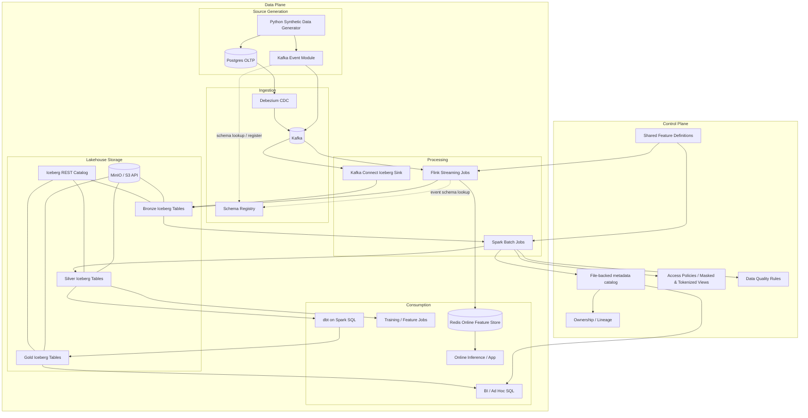
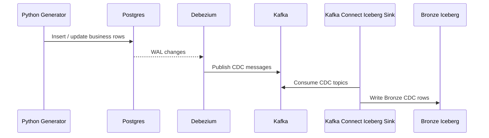
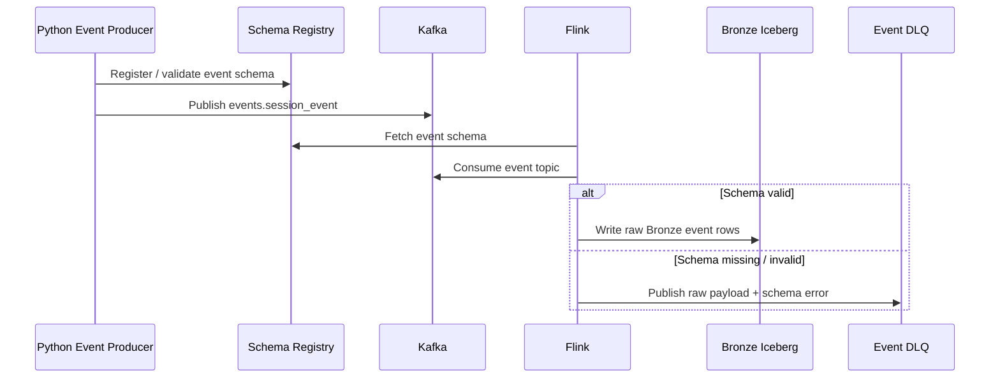
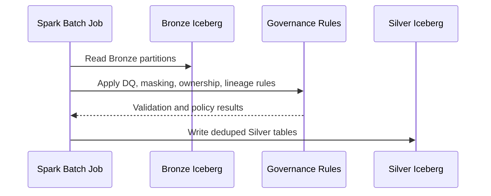
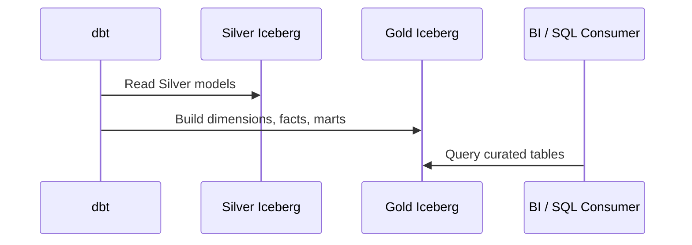
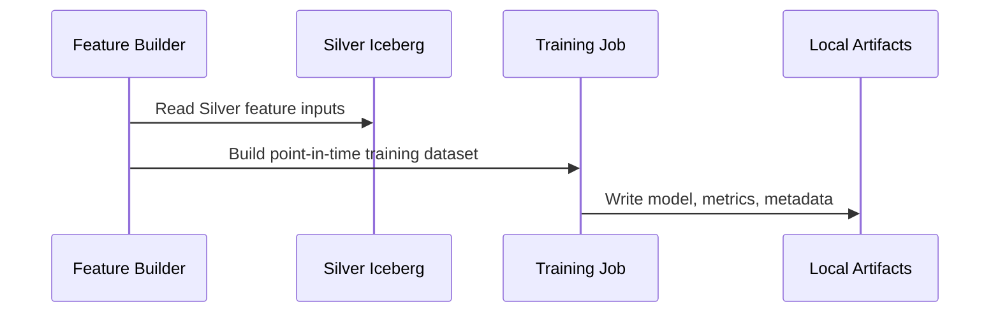
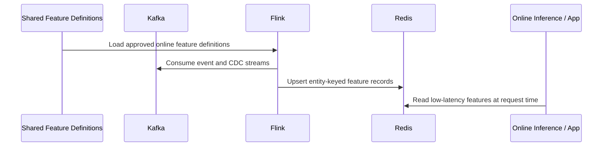

# Architecture

> Note
> This architecture file still describes the pre-split combined platform. The current repo is being narrowed to the data platform boundary described in [../docs/ml_platform_split.md](../docs/ml_platform_split.md).

## 1. Overview

The system is a laptop-scale but production-shaped data and ML platform for a synthetic retail advertising and commerce domain. It generates source data into Postgres and Kafka, captures CDC with Debezium, lands replayable Bronze data in Iceberg on MinIO, builds governed Silver data with Spark, curates Gold analytics and feature tables with dbt, serves BI through Trino and Apache Superset, and supports ML training plus approved Redis-backed online features. The design preserves replayability, explicit governance, deterministic derived layers, and a lightweight operational footprint.

### Primary Design Drivers
- Replayable Bronze, Silver, Gold, and online feature layers.
- Deterministic transformation behavior.
- Explicit governance for masking, tokenization, ownership, lineage, classification, and certification.
- Shared versioned feature definitions across offline and online paths.
- Low infrastructure footprint suitable for local or developer-scale Kubernetes execution.

### Architecture Style
- Hybrid batch and streaming lakehouse architecture with a separate metadata and governance control plane.

## 2. Component Design

### Synthetic source generation
- Two output paths: Postgres writer for mutable business tables and Kafka producer for behavioral `session_event`.
- The generator is the only component intended to run manually from the command line in local development.
- It generates baseline dimensions, mutable entity updates, sessions, orders, sales activities, and direct event streams with controlled duplicates and lateness.

### Postgres
- Acts as the OLTP simulation layer for CDC-managed source-of-truth business tables.

### Debezium and Kafka Connect
- Debezium reads Postgres WAL changes and emits Kafka CDC topics.
- CDC is used for business and transactional state rather than the high-volume clickstream.
- Kafka Connect writes Bronze CDC Iceberg tables through one Apache Iceberg sink connector per source table.
- This removes Flink CDC handling from the operational CDC path while keeping Kafka as the transport backbone.

### Kafka
- Holds both CDC topics and direct event topics.
- Local deployment uses a single-broker Kafka cluster in KRaft mode.

### Flink
- Implemented in PyFlink.
- Consumes direct event streams, lands raw direct-event history to Bronze, computes approved online features, writes low-latency serving features to Redis, resolves direct-event schemas through Schema Registry, and routes schema failures to DLQ.
- Flink responsibilities also include lightweight streaming normalization where helpful.

### Spark
- Runs via `spark-submit` in the Spark container in `local[*]` mode.
- Performs Bronze validation, dedupe, current-state resolution, delete handling, masking, quarantine handling, aggregate construction, backfills, offline feature creation, and offline-versus-Redis parity reconciliation.
- Spark batch responsibilities also include canonical offline feature dataset creation.

### Iceberg, MinIO, and REST catalog
- MinIO stores Iceberg data files.
- Iceberg provides schema evolution, partitioning, and ACID table management.
- The Iceberg REST catalog is used for namespace and table access.
- Local mode keeps the catalog single-node and lightweight.
- The current local implementation uses the existing Postgres service as the JDBC metadata backend for the REST catalog.
- That shared Postgres usage is a demo shortcut; more realistic deployments would isolate OLTP, Iceberg catalog, Superset metadata, and related control-plane state.
- Bronze CDC namespaces and table DDL are bootstrapped by a dedicated compose-managed service when the REST catalog comes online rather than owned by Spark or Flink.

### Schema Registry
- Used only for `events.session_event`.
- Direct event producers and consumers use it for contract and evolution management.
- Local endpoints are `http://schema-registry:8081` from containers and `http://localhost:8081` from the host.
- CDC topics intentionally remain on Debezium’s native envelope without Schema Registry registration.
- Debezium can integrate with Schema Registry, but that integration is intentionally not used for CDC topics in this design.
- In local mode Schema Registry remains useful for schema evolution demos, serializer compatibility checks, consumer contract validation, and topic contract visibility.
- The direct-event subject strategy is topic-based subjects for key and value with `BACKWARD` compatibility.
- Producers must register or validate the subject before publishing.
- Consumers must reject payloads that do not match the required registered schema contract.
- If a direct event cannot be deserialized with the required subject or compatible schema version, it must go to DLQ with raw payload, Kafka metadata, schema subject/version if present, and failure reason.

### dbt
- Executes Spark SQL transformations against Silver Iceberg tables.
- Produces conformed dimensions, reusable facts, and business-facing marts.
- Responsibilities include stable metric definitions and join paths, curated column naming for dashboard authors, dimensional consistency across marts, tests, and lineage for trusted BI consumption.

### BI
- Apache Superset is the standard BI path in local deployment.
- Superset connects only to curated Gold schemas by default.
- Certified Gold marts are promoted in the catalog and mirrored as approved Superset datasets.
- Ad hoc SQL access can share the same Trino endpoint while dashboards remain the primary BI surface.
- Required prebuilt BI assets include datasets, SQL queries, charts, and dashboards for campaign performance, advertiser engagement, customer browse-to-purchase funnel analysis, and category/product/channel contribution.

### ML and inference
- The platform supports three concrete operational decision problems: customer purchase propensity, campaign success propensity, and advertiser budget expansion propensity.
- Training reads dbt-built feature tables in `iceberg.silver`.
- Training jobs read those feature tables directly.
- Artifacts are written locally under `ml/artifacts/`, published canonically to MinIO, and registered in `iceberg.silver.ml_model_registry`.
- The compose-managed `ml-inference` container serves separate HTTP endpoints per use case.
- Model refresh is handled by the compose-managed `ml-training` container, which retrains and republishes all configured models.
- Customer scoring uses Redis online features plus offline context hydrated through Trino; campaign and advertiser scoring hydrate offline context from Iceberg-backed feature tables through Trino.
- The current local baseline algorithm family is custom logistic regression for the three local binary classification problems.
- Customer purchase and campaign success scores can be emitted side by side from the same demo workflow without changing the streaming or batch platform layers.
- Customer purchase propensity addresses whether a customer is likely to purchase soon and is intended for promotions, recommendations, nudges, and discount-efficiency decisions.
- Campaign success propensity addresses whether a campaign is likely to perform well soon and is intended for ranking, intervention, and account-team prioritization.
- Advertiser budget expansion propensity addresses whether an advertiser is likely to increase spend soon and is intended for outreach, upsell detection, and account-management prioritization.
- Representative feature inputs include recent views, ad clicks, add-to-cart activity, purchase history, average order value, recency, recent impressions, CTR, attributed orders, attributed revenue, active campaigns, and sales contact activity.
- Current local model artifact families are `customer_realtime`, `campaign`, and `advertiser`.
- Example scoring outputs are `customer_purchase_propensity`, `campaign_success_propensity`, and `advertiser_budget_expansion_propensity`.
- Current local scoring pattern combines the latest model artifact with Redis-served online features where applicable and offline context hydrated from Iceberg-backed feature tables through Trino.
- ML artifact outputs include training dataset snapshots, model binaries, metrics JSON, and feature definition version metadata.
- Spark periodically recomputes the same feature values from Bronze or Silver for parity checks and historical truth.
- Online inference or application services retrieve features from Redis at request time.

## 3. Interaction and Data Flow

### Primary flow
1. Synthetic generators write operational entities into Postgres and behavioral events into Kafka.
2. Debezium captures source-table changes into Kafka; direct events are validated against Schema Registry subjects.
3. Kafka Connect sinks CDC topics into Bronze Iceberg tables, and Flink lands valid direct events into Bronze while routing schema failures to DLQ.
4. Spark reads Bronze, runs quality checks, applies deterministic deduplication plus governance controls, and publishes Silver.
5. dbt reads Silver only and builds Gold dimensions, facts, marts, and feature tables.
6. Trino, Superset, and ML jobs consume curated outputs; Flink and Redis support approved low-latency feature serving.
7. Model artifacts are cached locally, published to MinIO, and registered in `iceberg.silver.ml_model_registry`.

### Sequence diagrams

#### CDC ingestion to Bronze

#### Direct event stream to Bronze

#### Bronze to Silver batch processing

#### Silver to Gold with dbt

#### Silver to ML training

#### Kafka stream to Redis online store

## 4. Trust Boundaries

### External boundary
- External actors: engineers, analysts, ML practitioners, and platform operators using local tools, Kubernetes, SQL engines, dashboards, and inference workflows.
- Entry points: source generators, Kafka topics, Trino queries, Superset dashboards, and ML or inference services.
- Authentication mechanism: repository- and environment-specific local credentials rather than full enterprise IAM.

### Internal boundary
- Explicit component boundaries exist across ingestion, processing, storage, metadata, and consumption layers.
- Authorization for sensitive data paths relies on governed dataset access intent supporting RBAC and ABAC-aligned restrictions.

### Sensitive data boundary
- Sensitive data includes PII and restricted joinable identifiers from customer, advertiser, and related domains.
- Sensitive handling rules are enforced primarily through masking, tokenization, and access-path separation.
- Ownership, classification, lineage, quality results, certification, and access intent remain queryable and reviewable.

## 5. Control Plane and Data Plane

### Control plane
- Owns governance policy definition, ownership registration, lineage metadata, classification, certification, masking, tokenization, discoverability metadata, and shared feature definitions.
- State lives in the file-backed metadata catalog, policy files, and versioned definitions.

### Data plane
- Owns source generation, CDC capture, streaming ingestion, Bronze storage, Spark Silver transformations, dbt Gold transformations, Redis online features, BI queries, and ML training and inference.
- State includes source streams, Iceberg data layers, Redis serving state, BI assets, and model artifacts.

### Separation rule
- Data-plane execution must not bypass control-plane governance definitions.
- Sensitive data publication, masking, tokenization, ownership, classification, and certification status are defined through governed metadata and transformation logic rather than ad hoc downstream use.

## 6. Local Deployment and Execution Model

### Local deployment design
- All infrastructure and bootstrap behavior should happen through Kubernetes manifests applied with `kubectl`.
- Topic creation, connector registration, catalog initialization, Schema Registry subject registration, and Superset bootstrap should be handled by container entrypoints, helper `Job` resources, or Kubernetes-managed bootstrap flows.
- The synthetic generator is the only repository component expected to be run manually from the command line.
- Local Kubernetes deployment must use workload-based namespaces rather than a single shared namespace.

### Namespace model
- Namespace grouping is based on workload responsibility so operators can isolate infrastructure, ingestion, processing, serving, and governance concerns.
- The canonical local namespace set is:
  `data-platform-infra` for shared stateful platform infrastructure,
  `data-platform-ingest` for CDC and ingestion workloads,
  `data-platform-process` for batch and streaming transformation workloads,
  `data-platform-serve` for query, BI, inference, and low-latency serving workloads,
  and `data-platform-govern` for metadata and governance-facing services.
- New workloads must be assigned to the namespace matching their primary operational responsibility. A workload that spans concerns should be placed by its primary write authority and cross-namespace access should be explicit.
- Bootstrap jobs should run in the namespace of the workload they initialize unless they are creating shared infrastructure primitives, in which case they belong in `data-platform-infra`.

### Kubernetes workloads
- `data-platform-infra`: `postgres`, `kafka`, `schema-registry`, `minio`, `iceberg-rest`
- `data-platform-ingest`: `generator`, `kafka-connect-source`, `kafka-connect-sinks`
- `data-platform-process`: `flink-jobmanager`, `flink-taskmanager`, `spark`, `dbt`, ML training and layer-bootstrap jobs
- `data-platform-serve`: `redis`, `trino`, `superset`, `ml-inference`
- `data-platform-govern`: `metadata`

### Networking and footprint
- Namespaces are separate, but service DNS and policies must preserve the same logical connectivity between producers, storage, processing, and serving layers.
- Exposed service endpoints include `kafka.data-platform-infra:9092`, `schema-registry.data-platform-infra:8081`, `minio.data-platform-infra:9000`, `trino.data-platform-serve:8080`, and `superset.data-platform-serve:8088`
- Desktop guidance is single Kafka broker, single Flink JM/TM, single Spark container in `local[*]`, single Redis, single Trino coordinator, single Superset container, single-node MinIO, tiny topic partitions, and constrained default row counts

### Execution model
- `kubectl apply -f k8s/platform.yaml` is the canonical startup path.
- Kubernetes-managed bootstrap jobs initialize Kafka topics, Kafka Connect connectors, Schema Registry subjects, catalog settings, and Superset across the workload-aligned namespaces.
- The synthetic data generator is the only component intended to be run manually from the command line.
- Flink continuously lands Bronze data and maintains approved online features.
- Spark batch jobs produce deterministic Silver datasets and offline ML features.
- Spark jobs may accept date or window parameters for rebuild and backfill operation.
- dbt builds curated Gold models for BI consumption.
- Metadata, governance, and quality artifacts are repository-managed and version-controlled.

### Implementation notes
- Some existing repository assets still reflect compose-era bootstrap helpers and are part of the documented local implementation shape, including `config/iceberg/bootstrap-cdc-rest-catalog.sh` and `config/debezium/register-connector.sh`.
- Docker Compose-era topic bootstrap logic initializes Kafka topics automatically during startup using helper containers, entrypoints, or bootstrap services; the bootstrap command may use `kafka-topics --create --if-not-exists --bootstrap-server kafka:9092`.
- Superset bootstrap expectations include `superset import-dashboards --path /app/bi/dashboards --username admin`.
- A local Trino connection URI such as `trino://trino:8080/iceberg` is acceptable for Superset bootstrap.
- Bootstrap references are expected to use `kubectl apply -f k8s/platform.yaml` rather than Compose-era startup commands.
- Existing bootstrap documentation may refer to Superset bootstrap running from `config/superset/bootstrap/` and local topic definitions under `config/kafka/topics/`.
- Existing manifests and runbooks may still show `data-platform` as a flat namespace; that is an implementation lag and not the target deployment contract.
- Repository structure is expected to center around `config/`, `generator/`, `flink/`, `spark/`, `dbt/`, `bi/`, `ml/`, `tools/`, `metadata/`, `docs/`, and `tests/`.

## 7. Tradeoffs and Notes

### Decision: `hybrid streaming and batch`
- Chosen approach: Flink handles direct events and low-latency online features; Spark and dbt handle deterministic Silver and Gold batch layers.
- Alternative considered: one engine for all transformations.
- Why chosen: matches realistic platform patterns while keeping the local implementation understandable.
- Cost of this choice: more moving parts and cross-engine coordination.

### Decision: `Iceberg + MinIO + REST catalog`
- Chosen approach: lightweight lakehouse stack with Iceberg tables on MinIO and Iceberg REST catalog.
- Alternative considered: heavier local metastore stacks or managed services.
- Why chosen: preserves realistic table semantics with low local operational weight.
- Cost of this choice: fewer enterprise conveniences and more repo-driven configuration.

### Decision: `file-backed governance metadata`
- Chosen approach: repository-managed metadata and governance definitions.
- Alternative considered: dedicated enterprise catalog and policy systems.
- Why chosen: keeps the platform lightweight while making governance explicit and reviewable in code.
- Cost of this choice: stronger process discipline is required to keep metadata aligned with datasets.

### Final note
- High-level rationale may live in `docs/architecture_rationale.md`, but implementation-defining architecture detail belongs under `SpecRepo`.
