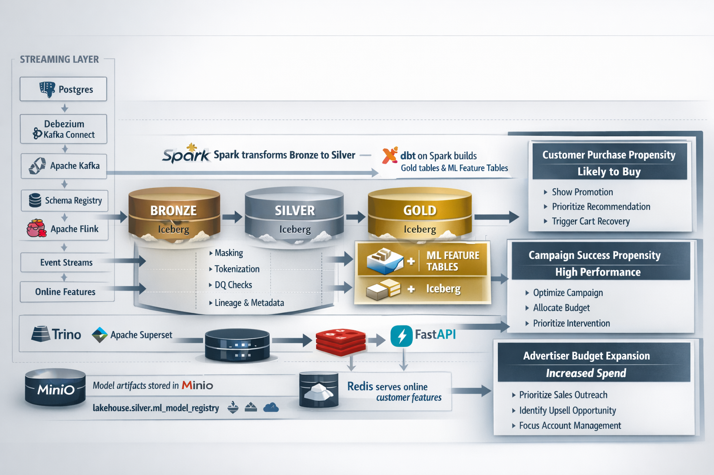

# From Data Pipelines to Real‑Time Decisions
## How Modern Platforms Turn Streaming Data into Operational ML

For many years, most data platforms were designed to answer a single question:

**What happened yesterday?**

Analytics systems were built around batch pipelines, dashboards, and reports that helped teams understand past behavior. That model worked well when the goal was insight.

But modern organizations are increasingly asking a different question:

**What should we do right now?**

Answering that question requires more than analytics. It requires systems capable of producing **real‑time decisions** based on continuously arriving data. That is where modern data platforms begin to evolve from *analytics systems* into *decision systems*.

This article walks through how that transition happens and how streaming systems, governed data pipelines, and ML inference services come together to support operational decisions.

The full working example of this platform, including the architecture definition and implementation, is available here: **https://github.com/brandon-benge/example-data-pipeline-w-ml**. The repository contains a detailed `ARCHITECTURE.md` that explains the design decisions and how each component fits into the overall platform.

---

# The Real Goal of an ML Platform

A common misconception is that ML platforms exist primarily to train models.

In practice, the real goal is much simpler and much harder:

**Support operational decisions at scale.**

To do that reliably, a platform must support three capabilities:

1. Reliable ingestion of operational data
2. Governed pipelines that produce trusted feature data
3. Inference services that deliver predictions at the moment decisions are made

Training models is necessary, but it is only one step in a much larger system. The real value appears when predictions can be delivered inside live business workflows.

---

# The Operational Decisions

To make this concrete, consider three example decisions a platform might support.

## Customer Purchase Propensity

**Question:** Is this customer likely to buy soon?

Possible actions might include:

- triggering a promotion
- prioritizing recommendations
- initiating cart‑recovery flows

These decisions often need to happen while the customer is still interacting with the product.

---

## Campaign Success Propensity

**Question:** Is this marketing campaign trending toward strong performance?

Possible actions might include:

- allocating additional marketing budget
- prioritizing campaign optimization
- intervening on underperforming campaigns

Here the platform helps marketing teams understand performance signals early enough to act.

---

## Advertiser Budget Expansion Propensity

**Question:** Is this advertiser likely to increase spend soon?

Possible actions might include:

- prioritizing sales outreach
- identifying upsell opportunities
- focusing account management attention

In this case the ML system converts operational signals into a prioritization mechanism for sales teams.

---

# Architecture: Turning Data Into Decisions

Supporting these decisions requires an end‑to‑end system rather than a single model.

A simplified flow looks like this:

Streaming ingestion  
→ Medallion data architecture  
→ Governed feature tables  
→ Model training  
→ Inference services  
→ Operational decisions

The key insight is that **real‑time ML depends on the entire platform**, not just the model.

---

# Streaming Ingestion

Operational systems produce the data that ultimately drives ML decisions.

In this project, the streaming ingestion layer is implemented using a concrete open data stack:

- **Postgres** as the OLTP source system
- **Debezium** running inside **Kafka Connect** to capture Postgres change data capture (CDC)
- **Apache Kafka** as the event backbone for CDC and event topics
- **Schema Registry** for event schema management

CDC events are then processed in two ways.

First, **Apache Flink** processes the event stream and writes raw events into **Apache Iceberg Bronze tables** using the `bronze-events-to-iceberg` job.

Second, Flink maintains short‑window behavioral signals and publishes them into **Redis** using the `online-features-to-redis` job so they can be used during real‑time inference.

The Iceberg tables themselves are managed through an **Iceberg REST Catalog**, with **MinIO** providing S3‑compatible object storage for the underlying data files.

Initial CDC table structures are bootstrapped using a small utility called **iceberg-cdc-bootstrap**, which uses **Trino** to create the required Iceberg Bronze tables and namespaces.

This combination turns database updates into replayable event streams while also landing raw data into the lakehouse.

---

# Where Streaming Changes the System

Up to this point the architecture still resembles many traditional data platforms. Streaming is where the system begins to change.

Batch pipelines are designed to answer questions about the past. If something breaks, the pipeline can usually be rerun and corrected later.

Streaming systems operate under different constraints. Events arrive continuously, ordering is not guaranteed, and stateful computations must remain correct while the system keeps running.

These characteristics become especially important once machine learning enters the platform.

Many useful ML features are based on short windows of recent behavior — for example:

- recent views
- recent clicks
- recent engagement signals

These signals lose much of their value if they are computed hours or days later. Streaming infrastructure allows them to be maintained continuously so they can be used during inference.

Seen this way, streaming systems keep the platform connected to **what is happening now**, while batch pipelines provide stable, reproducible datasets for training.

Together they enable the platform to support real operational decisions.

---

# Governed Data Pipelines

Raw data alone is rarely sufficient for ML systems. Features must be reliable, reproducible, and governed.

A common structure for this is the **medallion architecture**:

Bronze → Silver → Gold

**Bronze** stores raw event and CDC data.  
**Silver** contains cleaned and normalized datasets.  
**Gold** contains curated analytics tables and ML feature tables.

In many modern platforms:

- **Apache Spark** performs Bronze‑to‑Silver processing, applying governance logic such as masking, tokenization, data‑quality checks, and lineage writes
- **dbt running on Spark** builds the **Gold tables and ML feature tables** on top of the governed Silver layer

All Bronze, Silver, Gold, and feature tables are stored in **Apache Iceberg**, with the **Iceberg REST Catalog** and **MinIO** managing metadata and storage. A lightweight **dbt‑scheduler** container triggers recurring dbt builds to keep analytics and feature tables current.

This separation ensures that model training relies on stable and well‑understood datasets.

---

# Training and Model Governance

Once feature tables exist, model training becomes relatively straightforward.

Training pipelines read feature tables using **Trino** as the SQL query engine over Iceberg. These features are then used in a standard Python ML workflow built around:

- pandas
- numpy
- scikit‑learn

In this example project, **logistic regression models** are trained for three operational decisions:

- customer purchase propensity
- campaign success propensity
- advertiser budget expansion propensity

Model artifacts are stored in **MinIO**, while model version metadata is written to an Iceberg table:

`lakehouse.silver.ml_model_registry`

This registry provides version tracking, reproducibility, and auditability for deployed models.

---

# The Most Important Layer: Inference

The step that ultimately creates value is **model inference**.

An inference service (often implemented with **FastAPI**) exposes endpoints such as:

POST /score/customer_purchase  
POST /score/campaign_success  
POST /score/advertiser_budget_expansion

These endpoints load the latest approved model and produce predictions when applications request them.

For real‑time decisions such as purchase propensity, short‑window behavioral signals are continuously maintained using **Apache Flink** and written into **Redis**.

The inference service, implemented with **FastAPI** in the `ml-inference` container, retrieves these online features from Redis and combines them with the trained model artifacts stored in MinIO. This allows the service to generate predictions using the most recent customer activity without recomputing those signals on every request.

---

# Why Platform Thinking Matters

At a leadership level, the challenge is not choosing individual tools.

The challenge is designing a platform where:

- operational systems produce reliable event streams
- governed pipelines produce trusted features
- models are versioned and reproducible
- inference services integrate directly with applications
- analytics systems (Trino + Superset) and ML systems share the same governed Iceberg datasets

When these pieces work together, the platform becomes capable of supporting **real operational intelligence**.

---

# Final Thought

The future of data platforms is not only about analytics.

It is increasingly about **decision infrastructure**.

Organizations that succeed will be those that connect:

Streaming data  
→ governed pipelines  
→ feature platforms  
→ inference services  
→ operational decisions

When done well, the platform does more than explain what happened.

It helps the business decide **what to do next real time.**
